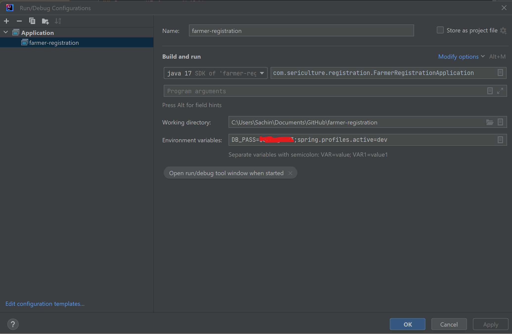
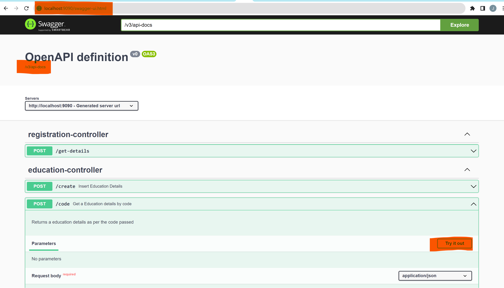

## Swagger UI Accessibility
http://localhost:8000/farmer-registration/swagger-ui.html

## Run Locally on Intellij

1.Set the Edit configurations to the the application locally

3.Swagger UI
   

## Postman collection
   check misc/postman

