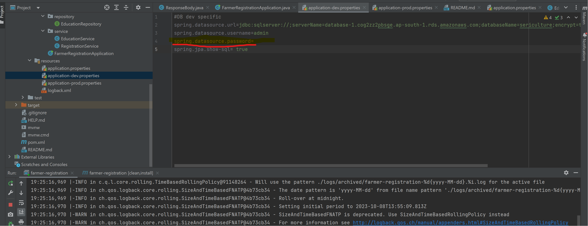

## Swagger UI Accessibility
http://localhost:9090/swagger-ui.html

## Run Locally on Intellij
1. Set the password in dev.properties
   

3. Set the Edit configurations to the the application locally

4. Swagger UI

